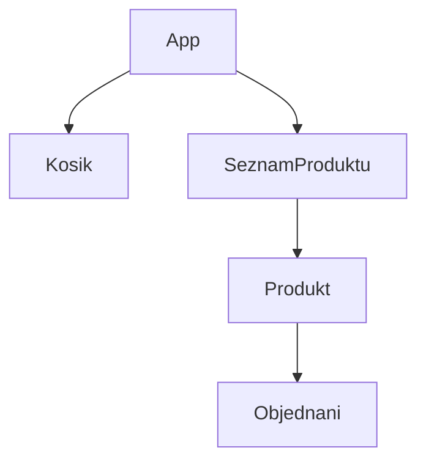

# Můj e-shop – cvičení pro komunikaci mezi React komponentami

## Cíle
* přidání/odebrání na produktu způsobí přidání/odebrání z košíku
* nelze do košíku přidat víc kusů, než je na skladě
* v košíku nelze mít záporný počet kusů
* produkty, které nejsou na skladě, nelze přidávat do košíku

## Schema komponent

